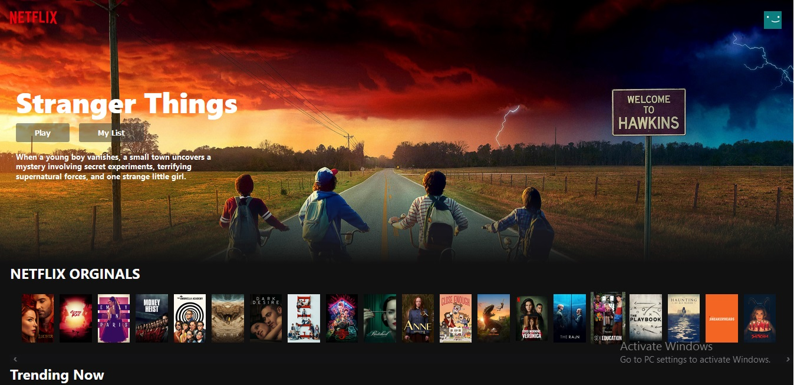

# Netflix-clone (using react and firebase)
---

Front-End netflix clone using react and firebase hosting

### Screen shot

### Steps

- creating account on tmdb and getting api key
- create new react app (npx create-react-app netflix-clone)
- setup firebase hosting (creating account and logged in to firebase for hosting the project)
- get all the movies (display all netflix orginals, trending now, action movie, horro movies to console from the tmd api using axios)
- build the rows
- build the banner
- build the nav bar
- add trailer popup (1.using react-youtube 2.using movie-trailer)
- deploy to firebase

### Demo hosted on firebase

[My-Netflix-clone](https://netflix-ff0c3.web.app/)

